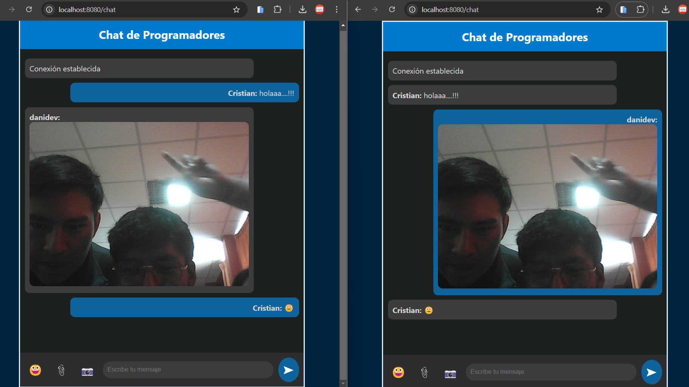
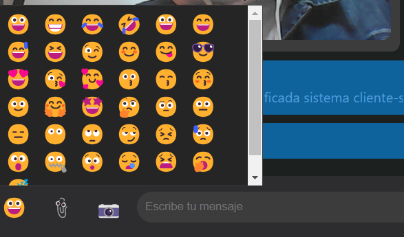
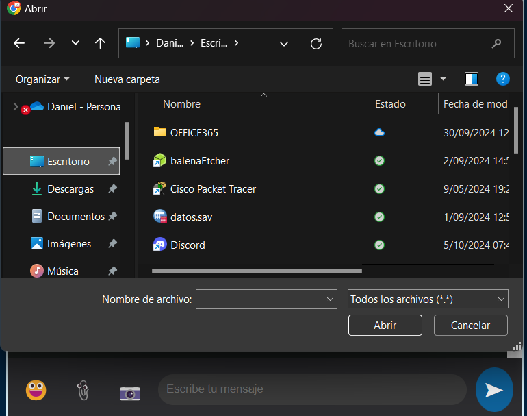
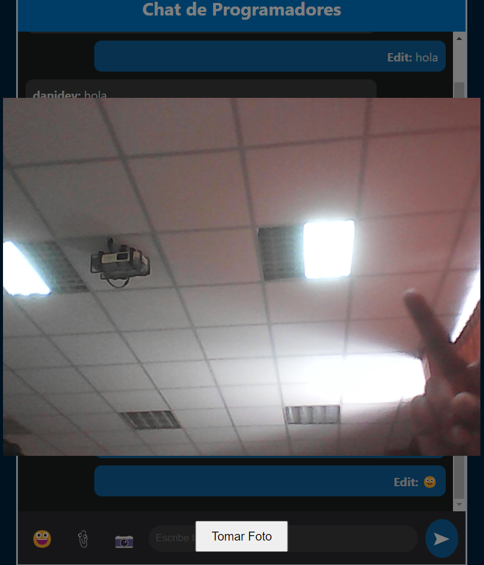

# Chat en Tiempo Real con CodeIgniter y Ratchet

## Descripción

Este es un chat en tiempo real desarrollado en PHP utilizando el framework CodeIgniter 4 y la biblioteca Ratchet para manejar WebSockets. La aplicación permite a los usuarios comunicarse de forma instantánea con funcionalidades avanzadas como:

- Envío y recepción de mensajes de texto.
- Soporte de emojis.
- Envío de imágenes y archivos de cualquier tipo.
- Descarga de archivos recibidos.
- Uso de la cámara para tomar y enviar fotos.
- Interfaz profesional con tema oscuro y opción de fondo personalizado.

## Características

- **Comunicación en Tiempo Real**: Mensajería instantánea utilizando WebSockets.
- **Soporte de Emojis**: Añade emojis a tus mensajes con un selector integrado.
- **Compartir Archivos**: Envía y recibe imágenes y archivos (hasta 5 MB).
- **Integración de Cámara**: Toma y envía fotos directamente desde la aplicación.
- **Interfaz Profesional**: Tema oscuro orientado a programadores, con posibilidad de personalizar el fondo.
- **Envío de Mensajes con Enter**: Envía mensajes rápidamente presionando la tecla Enter.
- **Compatibilidad Multiplataforma**: Funciona en navegadores modernos y es responsive para dispositivos móviles.

## Instalación

### Requisitos Previos

- **XAMPP** (versión 8.1.25) o cualquier entorno de desarrollo PHP compatible.
- **Composer** instalado en tu sistema.
- **CodeIgniter 4** instalado.
- **Ratchet WebSocket** instalado vía Composer.

### Pasos de Instalación

1. **Clonar el Repositorio**

   Clona este repositorio en tu directorio de proyectos:

   ```bash
   git clone https://github.com/tuusuario/tu_repositorio.git
   ```

2. **Navegar al Directorio del Proyecto**

   ```bash
   cd tu_repositorio
   ```

3. **Instalar Dependencias**

   Ejecuta Composer para instalar las dependencias necesarias:

   ```bash
   composer install
   ```

4. **Configurar CodeIgniter**

   - Renombra el archivo `.env.example` a `.env` y establece el entorno a desarrollo:

     ```
     CI_ENVIRONMENT = development
     ```

   - Configura la URL base en el archivo `.env`:

     ```
     app.baseURL = 'http://localhost:8080/'
     ```

5. **Instalar Ratchet**

   Si no lo has hecho, instala Ratchet:

   ```bash
   composer require cboden/ratchet
   ```

6. **Iniciar el Servidor WebSocket**

   En una terminal, ejecuta:

   ```bash
   php server.php
   ```

7. **Iniciar el Servidor de CodeIgniter**

   En otra terminal, ejecuta:

   ```bash
   php spark serve
   ```

## Uso

1. **Acceder a la Aplicación**

   Abre tu navegador web y ve a:

   ```
   http://localhost:8080/chat
   ```

2. **Ingresar Nombre de Usuario**

   - Introduce un nombre de usuario para identificarte en el chat.
   - Haz clic en **"Entrar al Chat"**.

3. **Enviar Mensajes**

   - Escribe tu mensaje en el campo de texto y presiona **Enter** o haz clic en el botón de enviar.
   - Para añadir emojis, haz clic en el botón de emoji y selecciona el que desees.

4. **Enviar Archivos**

   - Haz clic en el ícono de **adjuntar** (📎) para seleccionar y enviar archivos (máximo 5 MB).
   - Puedes enviar imágenes, documentos y cualquier tipo de archivo.

5. **Usar la Cámara**

   - Haz clic en el ícono de **cámara** (📷) para tomar una foto y enviarla directamente en el chat.

6. **Descargar Archivos**

   - Los archivos recibidos se mostrarán con un enlace de descarga. Haz clic en el nombre del archivo para descargarlo.

## Capturas de Pantalla

### Interfaz Principal del Chat



*Figura 1: Interfaz principal con tema oscuro y fondo personalizado.*

### Selector de Emojis



*Figura 2: Selector de emojis para enriquecer tus mensajes.*

### Envío de Archivos



*Figura 3: Envío y recepción de archivos con opción de descarga.*

### Uso de la Cámara



*Figura 4: Toma y envío de fotos directamente desde la aplicación.*

> **Nota**: Las imágenes se deben colocar en una carpeta llamada `screenshots` dentro del directorio principal del proyecto. Asegúrate de actualizar las rutas si las imágenes están en una ubicación diferente.

## Documentación Técnica

El proyecto está estructurado de la siguiente manera:

- **Controladores**: Manejan las solicitudes y responden con las vistas correspondientes.
- **Vistas**: Contienen el código HTML y JavaScript de la interfaz del usuario.
- **WebSocket Server (`server.php`)**: Maneja las conexiones WebSocket utilizando Ratchet.
- **Archivos Estáticos**: CSS y JavaScript incluidos en las vistas para estilizar y dar funcionalidad a la aplicación.

### Archivos Clave

- `app/Views/chat_view.php`: Contiene la interfaz del chat y el código JavaScript para la interacción en tiempo real.
- `app/Websocket/Chat.php`: Lógica del servidor WebSocket que maneja los mensajes entre los clientes.
- `server.php`: Script que inicia el servidor WebSocket.

## Licencia

Este proyecto está bajo la Licencia MIT - ver el archivo [LICENSE](LICENSE) para más detalles.

## Autor

[Cristian Daniel](danielccopa76@gmail.com)
